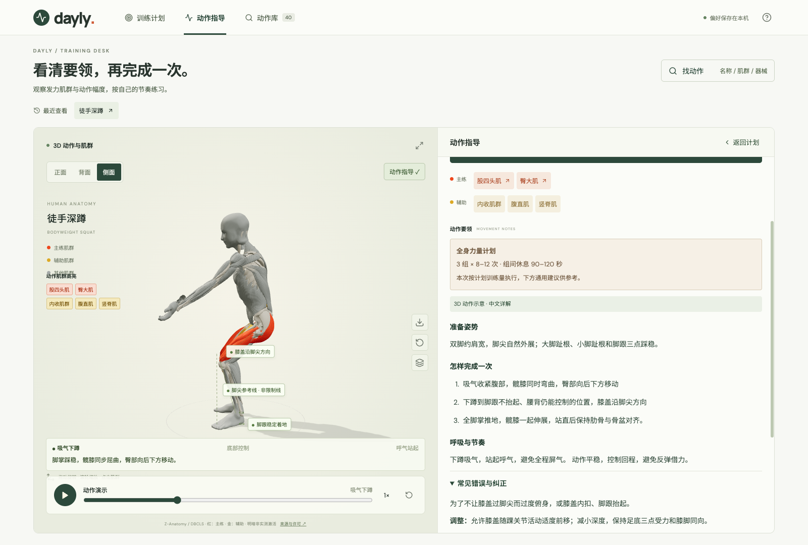
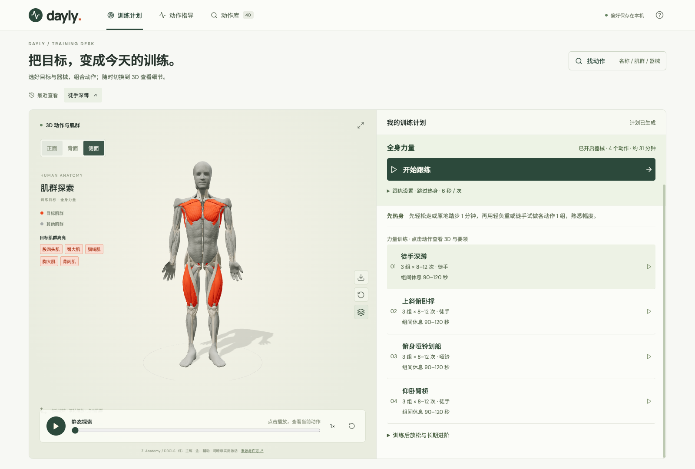
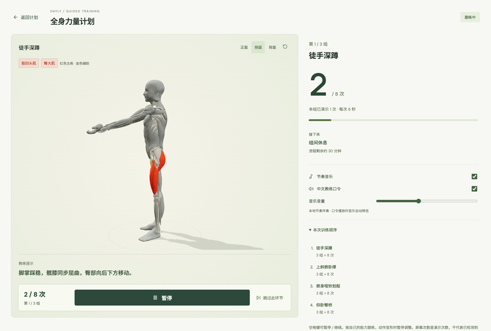
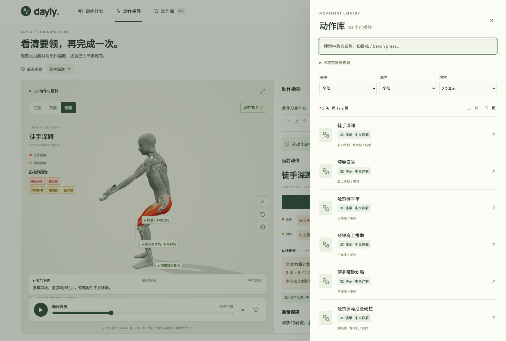

<div align="center">

# Dayly · 肌肉与动作实验室

**看清肌肉发力，理解动作要领，按计划开始跟练。**

React 19 · TypeScript · Three.js · Vite

[项目亮点](#项目亮点) · [界面预览](#界面预览) · [快速开始](#快速开始) · [当前边界](#当前边界) · [来源与许可](#来源与许可)

</div>



Dayly 是面向桌面浏览器的 3D 健身学习与跟练应用。将人体肌群、动作指导、目标训练计划和带音乐口令的顺序跟练放在同一个工作区，帮助用户从“想练什么”走到“这一组怎么做”。

| 肌群 | 动作资料 | 3D 动作示意 | 中文详细指导 |
| :---: | :---: | :---: | :---: |
| 16 类 | 882 条 | 40 个 | 42 份 |

> 882 条资料中，40 个动作配有 3D 示意，其余为参考资料。所有截图均来自实际运行的应用。

## 项目亮点

- **看见发力部位**：采用 Z-Anatomy / BodyParts3D 解剖网格，主练肌群显示红色、辅助肌群显示金色；支持旋转、多视角查看和暂停观察。
- **把要领放在演示旁边**：展示准备姿势、执行步骤、呼吸节奏、常见错误与纠正、难度调整和组次建议。用动作名称或简短描述在本地查找动作。
- **从目标生成计划**：支持腹肌强化、减脂、提升心肺、全身力量和自选肌群；默认无需器械，按用户明确选择的器械与难度筛选。
- **一键顺序跟练**：模型加载完成后自动开始，按计划推进动作、组次、保持时间和休息；支持暂停、继续、跳过与单侧动作换侧。
- **音乐与中文口令同步**：本地节奏伴奏、中文报数和准备提示随跟练时钟推进；音乐、口令可分别开关。
- **方便查看与复用**：最近查看和偏好保存在本机；训练计划可导出 JSON，当前蒙皮姿态可导出 GLB。

## 界面预览

### 目标训练计划

生成计划后，开始跟练按钮、动作数量与预计时长位于显眼位置。下图是用户主动开启器械、难度不限时生成的全身力量示例；默认设置仍为徒手入门。



### 按组次跟练

模型演示、当前次数、组数、提示和训练顺序集中展示。默认热身 1 分钟，已热身时可跳过；空格键暂停或继续。



### 可检索的动作库

按名称、肌群、器械与内容类型筛选，明确区分“有 3D 示意”“有中文详解”和“参考资料”。



## 快速开始

需要 **Node.js 22** 和 npm。模型与运行时音频随仓库提供，无需配置 API 密钥。

```bash
git clone https://github.com/starramble/daylyfitness.git
cd daylyfitness
npm ci
npm run dev
```

浏览器打开 [http://127.0.0.1:5173](http://127.0.0.1:5173)。

```bash
npm test       # 单元测试与真实模型回归
npm run build  # TypeScript 检查与生产构建，输出至 dist/
```

应用可作为静态站点部署；本仓库暂未配置线上演示站点。

## 一次典型使用流程

1. 选择训练目标、难度和可用器械，生成训练计划。
2. 点击计划中的动作，旋转 3D 模型，查看肌群与中文要领。
3. 返回计划，选择跟练节奏和热身安排，点击“开始跟练”。
4. 按提示完成各组；需要时暂停、继续或跳过，结束后查看放松与进阶建议。

偏好仅保存在当前浏览器，尚无账户同步。跟练次数是**演示次数**，应用没有通过摄像头检测用户实际完成情况。

## 技术实现

| 部分 | 实现 |
| --- | --- |
| 交互与状态 | React 19 + TypeScript，本机偏好存储 |
| 人体模型 | Three.js，共享 49 个骨骼关节，实际肌肉、肌腱与骨骼网格 |
| 动作与接触 | 程序姿态、两段骨骼逆运动学、肘膝屈伸轴、手脚支撑与握持位置约束 |
| 前臂转动 | 每侧 3 个轴向骨骼，分散转掌，避免将全部扭转集中在手腕 |
| 计划与跟练 | 目标筛选、组次与休息编排，同一时钟驱动动画、计次与音频 |
| 数据 | Free Exercise DB 来源资料 + 自编演示与中文指导 |
| 构建与检查 | Vite、TypeScript、Node test runner；GitHub Actions 自动测试和构建 |

### 代码导航

```text
src/
  App.tsx                 # 计划、指导、动作库工作区
  BodyScene.tsx           # 3D 渲染、镜头、高亮与 GLB 导出
  bodyRig.ts              # 骨架、指节、前臂旋转与握持点
  anatomyAsset.ts         # 解剖资产、肌肉材质与蒙皮权重
  movement.ts             # 基础动作、关节求解与阶段提示
  extendedMovement.ts     # 扩展动作与器械接触
  trainingPlan.ts         # 目标、动作选择、剂量和有氧安排
  FollowAlong.tsx          # 跟练界面
  followSession.ts        # 时间、组次、换侧与休息编排
  followAudio.ts          # 音乐与教练口令
  catalog.ts              # 动作资料整合与搜索
  test-fixtures/          # 面部保护与旧蒙皮对照测试资源
public/
  models/                 # 当前解剖模型与来源声明
  audio/coach/            # 中文口令
  references/             # 人体比例参考图
```

现有 45 项测试覆盖数据与推荐规则、计划编排、跟练时钟、动作切换、40 个动作的完整循环、关节与掌面朝向、真实臂骨和肌腹刚性、肩部异常网格拉伸以及面部保护。测试验证程序行为，不等同于专业动作验收。

模型加工与音频生成脚本位于 `scripts/`。这些是可选开发工具：模型加工需要 Blender 和上游源文件，中文口令重新生成需要 macOS Tingting 与 FFmpeg；普通运行和测试不依赖这些工具。历史加工过程见 [开发记录](docs/development-history.md)。

## 当前边界

- 动作为人工编排的 **3D 示意**，没有运动捕捉、肌肉力学求解或完整软组织碰撞，也尚未经过专业教练逐动作验收。
- 肌群颜色表达动作中的主要与辅助作用，不代表实测肌电激活强度。
- 本地文字识别依赖规则与已有词条，不能理解任意自由描述；计划没有结合个人伤病或完整训练史生成处方。
- 默认“徒手＋入门”的减脂计划目前只有深蹲、臀桥两项力量动作，另配快走。这是可播放动作覆盖不足，尚未实现 A/B 轮换计划。
- 快走目前只有计时、文字和口令，没有 3D 步行动画；GLB 导出保留当前姿态与骨架，不含烘焙动画轨道。

## 来源与许可

感谢提供开放资料的项目：

- [Z-Anatomy](https://github.com/LluisV/Z-Anatomy)：肌肉与骨骼来源，CC BY-SA 4.0。
- [BodyParts3D / DBCLS](https://lifesciencedb.jp/bp3d/)：解剖表面来源；所用源资产保留 CC BY-SA 2.1 Japan 声明。
- [Free Exercise DB](https://github.com/yuhonas/free-exercise-db)：动作资料，Unlicense。

解剖模型、测试用模型及截图中的衍生解剖内容保留相应来源署名和适用的共享条款。分发模型时须附带 [模型 NOTICE](public/models/NOTICE.txt)；动作资料许可见 [Free Exercise DB LICENSE](public/data/free-exercise-db-LICENSE.txt)。

中文口令由 macOS Tingting 合成，原文和生成方式保存在 `public/audio/coach/manifest.json` 与 `scripts/generate-coach-audio.py`，并非真人教练录音。
